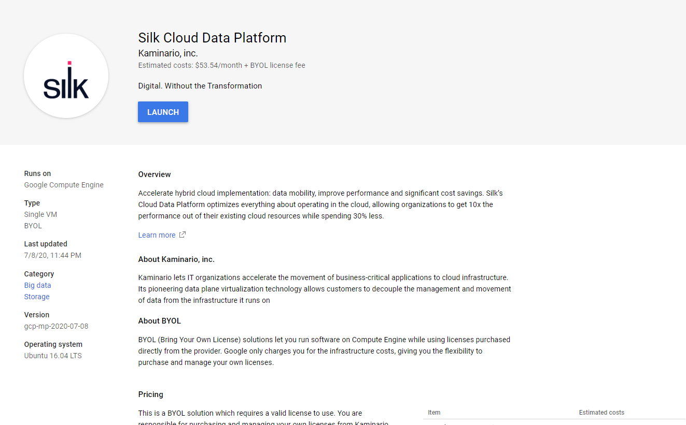
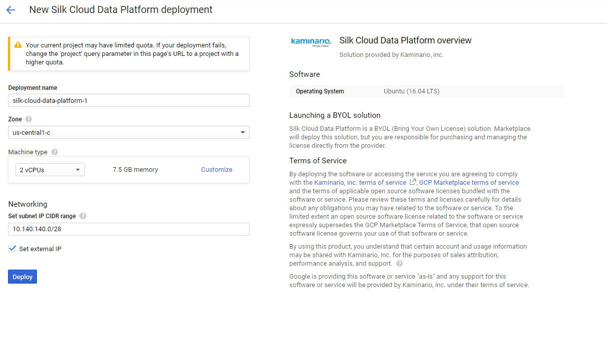
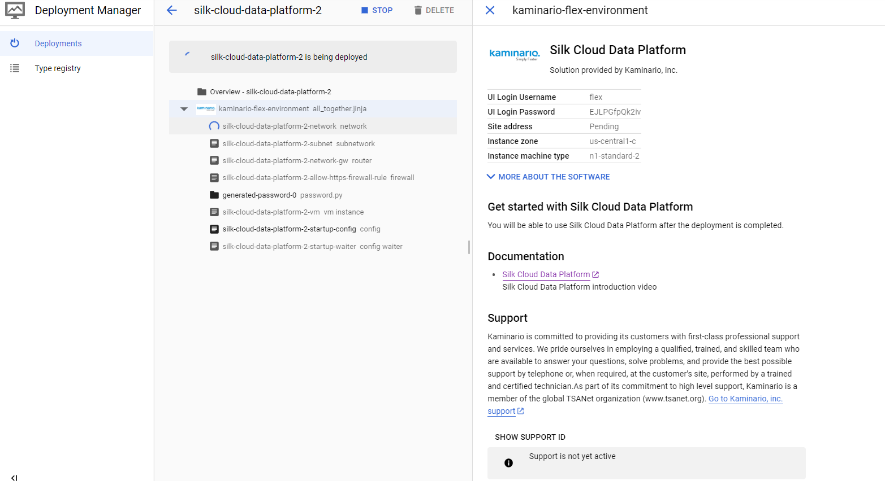
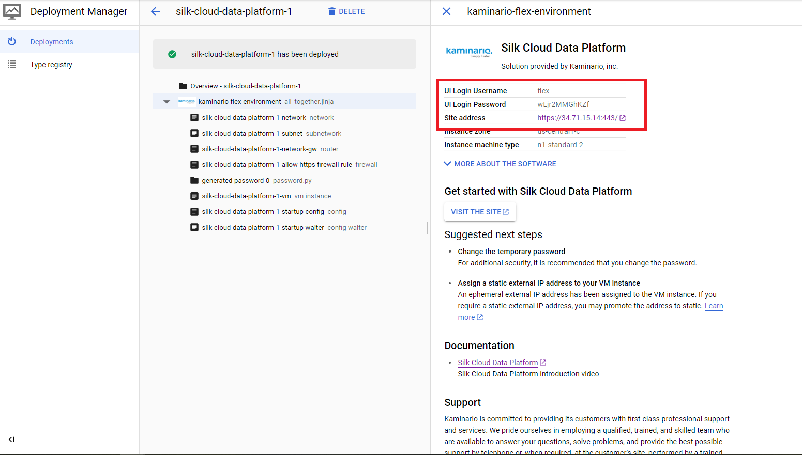
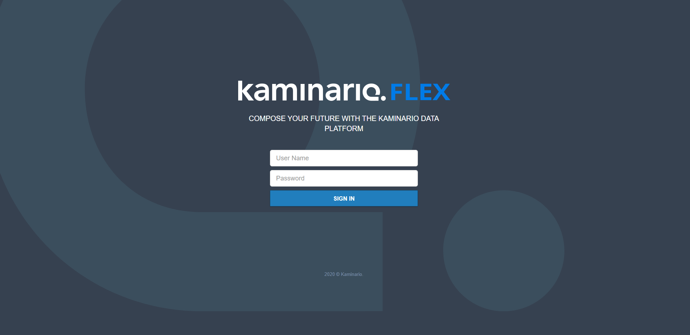
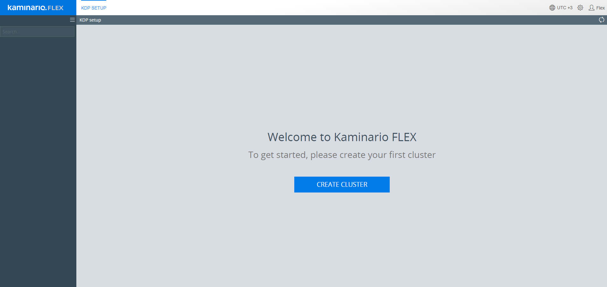
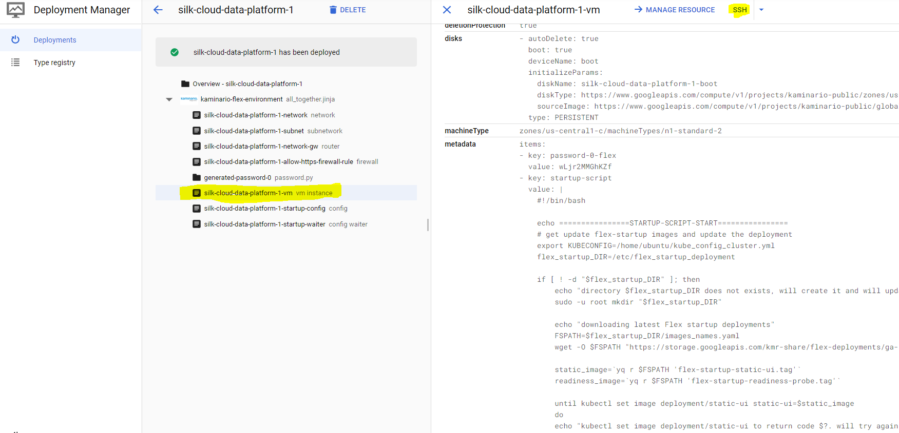
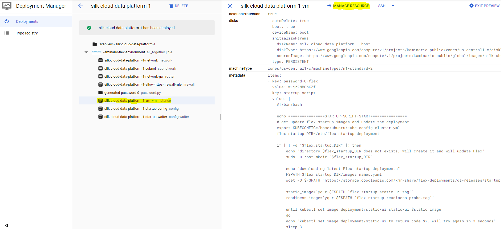
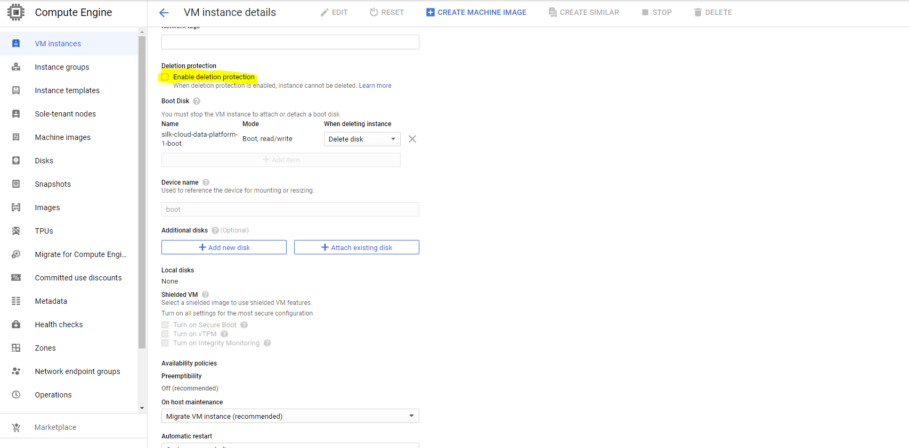

# silk-cloud-data-platform

## Deploying

First off we're going to deploy Flex. Flex is Silk's cloud data platform Orchestrator. It enables you to provision a new storage system in a few clicks plus scale it up or down according to your needs.

To start simply go to https://console.cloud.google.com/marketplace/details/kaminario-public/silk-cloud-data-platform and click on *LAUNCH*.

You can take the default settings or customize them.

**Please notice that in order to ease initial setup the "set external ip" is turned on by default. This is mostly for ease of setup or for quickly testing out the system. Although we setup proper firewall rules and only enable HTTPS (port 443) access - this should not be used for production systems or turned off manually after initial deployment!**

As part of the deployment we create a new VPC network. 
The "Set subnet IP CIDR range" option defines which subnet address range, inside the VPC network above, Flex will create. 
**It's important this range doesn't collide with any other network address range you plan to peer to in the future** 

When complete click "Deploy".

That's it! Flex is now deploying.

##  Inspecting the deployment

When complete you should see:

Please notice that when the deployment is complete you'll be presnted with the UI Login Username as well as a secure auto generated UI Password which you will use in the next step in order to login to the system.

To start using Flex, in case one choose to set an external ip, you can quickly click on the Site address.
Notice, that GCP will warn you that you're being redirected to a site outside of google. This is normal behavior created by Google in order to warn users their leaving the Google web site.

If you didn't setup an external ip address for the initial setup - you'll need to access the VM via the internal address of the VM.
Please see instructions on how to securely connect to a VM instance that does not have an external ip address https://cloud.google.com/solutions/connecting-securely#connecting_to_instances_without_external_ip_addresses

##  Login and cluster creation

Using the flex username and auto generated password from the previous step - please login to the system.
After you login you can start creating your first cluster by clicking on the "Create Cluster" button and following the steps in the wizard.

In order to obtain a cluster file - please contact us at https://support.silk.us/

## SSH the VM

In general - there is no need to SSH the machine unless this was requested by support or you would like to examine the open source licenses used by this solution (see next section).
The VM instance name is the *{deployment name}-vm*. e.g, if the deployment name was *silk-cloud-data-platform-1* then the VM instance name will be *silk-cloud-data-platform-1-vm*.
As demonstarted in the image below, by clicking on the vm instance name and on the SSH button - one can SSH the VM instance.

## Open source licenses

All open source license can be found under */licenses* and */sourcecode* folders on the VM instance.

## Important note regarding how to delete the deployment

Please notice that in order to successfully delete the deployment one must first remove the *Enable deletion protection* flag from the VM instance that was created by the deployment.
The VM instance name is the *{deployment name}-vm*. e.g, if the deployment name was *silk-cloud-data-platform-1* then the VM instance name will be *silk-cloud-data-platform-1-vm*.

Directly from the deployment page and as described in the image below, one can click on the *MANAGE RESOURCE* button which will redirect you to the *VM instance details* page.

Click on EDIT button and scroll down to the Deletion Protection section and remove the *Enable deletion protection* flag.

Finally - scroll down and click on the *Save* button.
From this point and on - you will be able to delete the deployment like you remove any other deployment.

